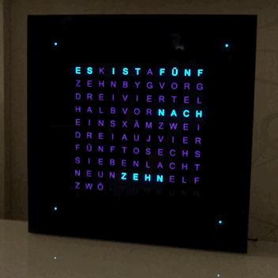
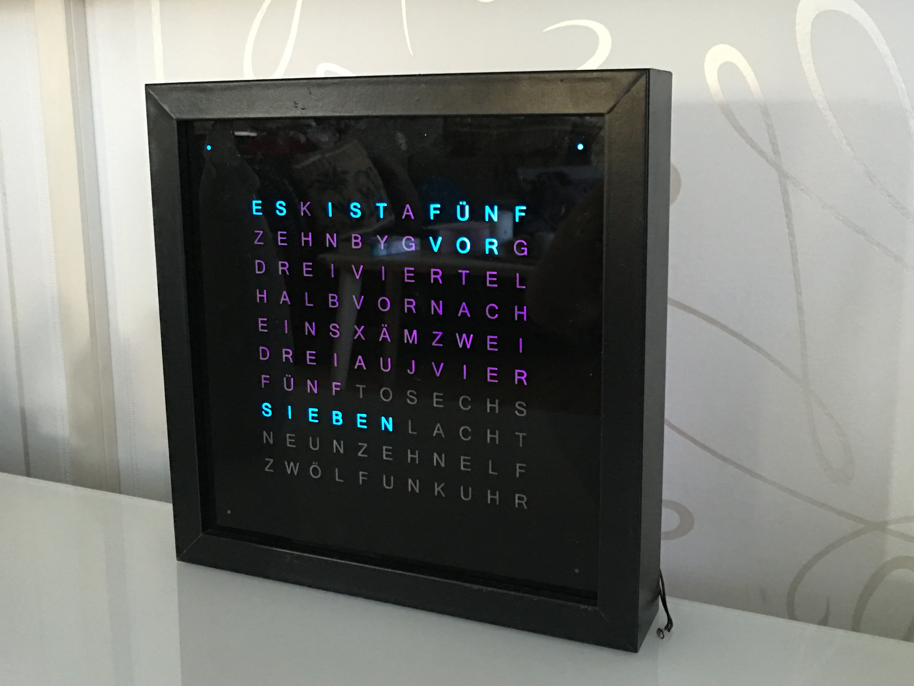

# esp8266wordclock
Wordclock with WS2812B RGB LED modules driven by an ESP8266 module

This is my interpretation of the popular wordclock project. Key features:

- runs on ESP8266 (ESP-07) and Wemos D1 mini
- using Arduino framework
- 114 WS2812B LEDs (driven by AdaFruit_NeoPixel library)
- WiFi connected
- WiFiManager allows for easy configuration when WiFi network is not yet configured
- NTP client regularly fetches time
- integrated web server handles configuration interface for colors, time server etc.
- automatic brightness using LDR 

# Projects
Here are some projects based on this code.

* [thoralt](https://github.com/thoralt):  
  [thoralt.md](doc/sampleProjects/thoralt.md)
* [dakky](https://github.com/dakky):  
  [dakky.md](doc/sampleProjects/dakky.md)

